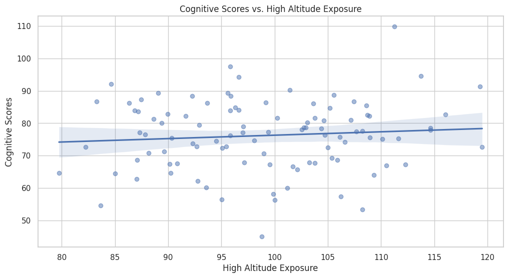

# Title: “Exploring the Cognitive and Physiological Effects of Ārepa Formulation under Cognitive Stress Conditions: A Systematic Approach Integrating Qualitative and Quantitative Analyses”

## LEEDS BECKETT UNIVERSITY

## PhD Projects in Psychology

By Heider Jeffer

Supervisor(s): Prof. Lauren Owen

I have created an official website on GitHub and a dedicated Lab for
Leeds Beckett University. These platforms will be used to store research
materials and execute the project methodologies online using Python code
I developed.

You can access them via the following links:

- Read and download online/offline the Proposal in
  [PDF](https://github.com/HeiderJeffer/PhD-Leeds-Beckett-University/blob/main/n.pdf)

<!-- -->

- **GitHub**: <https://github.com/HeiderJeffer/PhD-Leeds-Beckett-University>      

- **Lab - LEEDS BECKETT UNIVERSITY**:

  - [ANOVA, regression, and t-tests - Developed using Python by Heider
    Jeffer](https://colab.research.google.com/drive/15NjSUGk4SvFHzr-GGLKPu_CWO94y-SXG)

  - [Distribution of cognitive scores - Developed using Python by Heider
    Jeffer](https://colab.research.google.com/drive/14qhCr8YvgzzQZp0HbPUG4kRJx3YpzuFo)

  - [Histogram, regression, and scatter - Developed using Python by
    Heider
    Jeffer](https://colab.research.google.com/drive/1HsfzlyiiHkLlAzLlFMaJIp-rD7qYtbao)

This proposal outlines a structured approach to investigating the
cognitive benefits of Ārepa formulation under conditions of cognitive
stress, aiming to contribute significantly to the field of nutritional
neuroscience and cognitive enhancement.

# Introduction

Plants rich in phytonutrients have been shown to benefit cognitive
function due to their effects on metabolic pathways, blood flow,
antioxidant activity, and neuroprotection. Blackcurrants, particularly
rich in polyphenolic flavonoids like anthocyanins, are of interest for
their potential cognitive benefits. The Ārepa formulation, derived from
New Zealand Blackcurrants, has shown promise in enhancing cognitive
function, especially under conditions of cognitive stress induced by
factors like high altitude and sleep deprivation. This PhD project aims
to further investigate these effects through rigorous scientific
inquiry.

# Background Literature

The literature review will focus on studies investigating the cognitive
effects of flavonoids and anthocyanins, emphasizing mechanisms of action
such as improved blood flow, antioxidant properties, and modulation of
neurotransmitter systems (Bell et al., 2015; Cox & Scholey, 2017; Li et
al., 2021). Additionally, research on dietary interventions under
cognitive stress conditions, such as high altitude and sleep
deprivation, will be explored to contextualize the study (Shannon et
al., 2016, 2017a, 2017b; Cook & Willems, 2019).

## Aims and Objectives

1.  To assess the efficacy of the Ārepa formulation in mitigating the
    cognitive and physiological effects of high altitude exposure.

2.  To evaluate the Ārepa formulation's effectiveness in protecting
    cognitive function during periods of sleep deprivation.

3.  To explore the potential benefits of Ārepa under conditions of cold
    or heat stress, or to delve deeper into its effects at high altitude
    or during sleep deprivation.

## Research Questions

- How does Ārepa supplementation affect attentional and working memory
  networks during high altitude exposure?

- What are the physiological and cognitive benefits of Ārepa
  supplementation under conditions of sleep deprivation?

- What additional cognitive benefits can be observed under cold or heat
  stress conditions?

# **Research Approach**

The proposed research aims to systematically investigate the efficacy of
the Ārepa formulation in enhancing and protecting cognitive function
under conditions of cognitive stress induced by high altitude, sleep
deprivation, and potential cold or heat stress. This comprehensive
approach integrates qualitative and quantitative methods to provide a
robust understanding of Ārepa's effects on cognitive performance and
physiological responses.

## Systematic Literature Review

**Purpose:** To consolidate existing knowledge on the cognitive effects
of anthocyanins and flavonoids, and the physiological responses to
cognitive stressors.

**Method:** Conduct a systematic review of peer-reviewed literature
using databases such as PubMed, Scopus, and Google Scholar. Synthesize
findings to inform the design of experimental studies, including
hypotheses formulation and methodological considerations.

**Outcome:** The review will provide a theoretical foundation for
understanding the mechanisms through which Ārepa formulation may
influence cognitive function under stress conditions.

## Experimental Design

**Purpose:** To empirically test specific hypotheses regarding the
cognitive and physiological effects of Ārepa supplementation under
controlled conditions.

**Methods**

- **Randomized Controlled Trials (RCTs):** Implement double-blind,
  placebo-controlled trials to assess the effects of Ārepa formulation
  on cognitive function, mood, stress, fatigue, vascular function, and
  metabolism. Participants will be randomly assigned to Ārepa or placebo
  groups.

- **Experimental Conditions:** Participants will undergo simulated high
  altitude exposure (e.g., hypobaric chamber or high-altitude location),
  controlled sleep deprivation protocols, and potentially cold or heat
  stress conditions (temperature-controlled environments).

- **Outcome Measures:** Utilize validated cognitive assessments (e.g.,
  attention tasks, working memory tests), physiological measurements
  (e.g., blood pressure, heart rate variability), and self-report scales
  (e.g., mood and fatigue questionnaires) to quantify quantitative data.

## **Data Collection and Analysis:**

**Purpose:** To gather comprehensive empirical evidence on Ārepa
formulation’s effects across diverse stress conditions.

**Quantitative Data Analysis**

- **Statistical Methods:** Employ ANOVA, regression analysis, and
  t-tests to analyze quantitative data. ANOVA will assess differences in
  cognitive performance and physiological responses between Ārepa and
  placebo groups across stress conditions. Regression analysis will
  explore relationships between cognitive outcomes and physiological
  measures. T-tests will evaluate changes in specific variables pre- and
  post-supplementation.

- **Software:** Use statistical software such as SPSS or R for rigorous
  data analysis, ensuring accuracy and reliability of results.

**Qualitative Data Analysis**

- **Thematic Analysis:** Conduct thematic analysis of qualitative data
  obtained through semi-structured interviews or open-ended
  questionnaires. Identify recurring themes related to participants’
  experiences with Ārepa supplementation, including perceived cognitive
  benefits, emotional responses, and challenges during stress
  conditions.

- **Integration of Qualitative and Quantitative Data:** Triangulate
  findings from both data sets to enrich understanding of Ārepa’s
  effects. This integration enhances the validity and depth of
  interpretations, providing a comprehensive perspective on cognitive
  resilience and physiological responses.

## **Ethical Considerations:**

**Purpose:** To ensure ethical conduct and participant welfare
throughout the research process.

**Methods:**

- **Ethical Approval:** Secure authorization from the institutional
  ethics committee prior to beginning data collection. Follow ethical
  standards for research involving human participants.

- **Informed Consent:** Obtain informed consent from all participants,
  ensuring voluntary participation and confidentiality of data.
  Communicate potential risks and benefits clearly.

## **Knowledge Integration and Dissemination:**

**Purpose:** To contribute new knowledge to the field of nutritional
neuroscience and cognitive enhancement.

**Methods:**

- **Integration:** Synthesize research findings with existing literature
  to advance understanding of Ārepa’s mechanisms on cognitive function
  under stress. Discuss implications for public health and potential
  applications in enhancing cognitive resilience across populations.

- **Dissemination:** Publish research outcomes in peer-reviewed journals
  and present findings at conferences to share insights with the
  scientific community. Foster dialogue and collaboration with
  researchers and stakeholders in the field.

# Research Plan

- **Year 1:** Conduct systematic literature review, refine research
  questions, and obtain ethical approval.

- **Year 2:** Initiate RCTs under controlled conditions of high altitude
  and sleep deprivation, with data collection and preliminary analysis.

- **Year 3:** Complete RCTs, analyze data, prepare manuscripts for
  publication, and disseminate findings through conferences and academic
  journals.

# References

- Bell, L., et al. (2015). A review of the cognitive effects observed in
  humans following acute supplementation with flavonoids, and their
  associated mechanisms of action. *Nutrients, 7*(12), 10290-10306.

- Cook, M. D., & Willems, M. E. T. (2019). Dietary anthocyanins: A
  review of the exercise performance effects and related physiological
  responses. *International Journal of Sport Nutrition and Exercise
  Metabolism, 29*(3), 322-330.

- Cox, K. H., & Scholey, A. (2017). Polyphenols for brain and cognitive
  health. In *Recent Advances in Polyphenol Research* (pp. 259-288).

- Li, P., et al. (2021). Protective effects of anthocyanins on
  neurodegenerative diseases. *Trends in Food Science & Technology,
  117*, 205-217.

- Shannon, O. M., et al. (2016). Dietary nitrate supplementation
  enhances high-intensity running performance in moderate normobaric
  hypoxia, independent of aerobic fitness. *Nitric Oxide, 59*, 63-70.

- Shannon, O. M., et al. (2017a). "Beet-ing" the mountain: A review of
  the physiological and performance effects of dietary nitrate
  supplementation at simulated and terrestrial altitude. *Sports
  Medicine, 47*, 2155-2169.

- Shannon, O. M., et al. (2017b). Effects of dietary nitrate
  supplementation on physiological responses, cognitive function, and
  exercise performance at moderate and very-high simulated altitude.
  *Frontiers in Physiology, 8*, 401.

# Appendix 

## ANOVA, regression, and t-tests - Developed using Python by Heider Jeffer

  


## Distribution of cognitive scores - Developed using Python by Heider Jeffer

  


## Histogram, regression, and scatter - Developed using Python by Heider Jeffer 

  


# Code Breakdown

This code will generate three plots:

1.  A histogram showing the distribution of cognitive scores for the
    Arepa and placebo groups.

2.  A regression plot showing the relationship between cognitive scores
    and high altitude exposure.

3.  A scatter plot showing the relationship between cognitive scores and
    sleep deprivation, differentiated by the Arepa and placebo groups.

The code and what each part does. This script simulates a research study
to investigate the effects of the Ārepa formulation on cognitive
function under stress conditions. The main parts of the script include
setting up the research framework, conducting randomized controlled
trials (RCTs), analyzing the data, and plotting the results.

# Initialization

The ArepaResearch class is created with several methods to simulate
different stages of the research process.

```
class ArepaResearch:

def \_\_init\_\_(self):

self.literature_review_complete = False

self.ethical_approval_obtained = False

self.experimental_data = None

self.qualitative_data = None
```

This initializes the class with boolean attributes to track the
completion of the literature review and ethical approval, and attributes
to store experimental and qualitative data.

# Systematic Literature Review

This method simulates a literature review.
```
def systematic_literature_review(self):

print("Conducting systematic literature review...")

\# Placeholder for actual literature review code

self.literature_review_complete = True

print("Literature review complete.")
```

# Ethical Approval

This method simulates obtaining ethical approval for the study.

```
def obtain_ethical_approval(self):

print("Obtaining ethical approval...")

\# Placeholder for actual ethical approval code

self.ethical_approval_obtained = True

print("Ethical approval obtained.")
```

# Randomized Controlled Trials (RCTs)

This method simulates the conduct of RCTs, generating synthetic data for
the participants.

```

def conduct_rcts(self):

if not self.literature_review_complete or not
self.ethical_approval_obtained:

raise Exception("Complete literature review and obtain ethical approval
first.")

print("Starting randomized controlled trials (RCTs)...")

n_participants = 100

arepa_group = np.random.choice(\[0, 1\], size=n_participants, p=\[0.5,
0.5\])

high_altitude = np.random.normal(100, 10, n_participants)

sleep_deprivation = np.random.normal(5, 1, n_participants)

cognitive_scores = np.random.normal(75, 10, n_participants) +
arepa_group \* 5

mood_scores = np.random.normal(50, 5, n_participants) + arepa_group \* 3

self.experimental_data = pd.DataFrame({

'arepa_group': arepa_group,

'high_altitude': high_altitude,

'sleep_deprivation': sleep_deprivation,

'cognitive_scores': cognitive_scores,

'mood_scores': mood_scores

})

print("RCTs complete and data collected.")
```

Here, 100 participants are randomly assigned to either the Ārepa or
placebo group. Data for high altitude exposure, sleep deprivation,
cognitive scores, and mood scores are generated using normal
distributions. Cognitive scores and mood scores are adjusted based on
group assignment.

# Quantitative Analysis

This method conducts various statistical analyses and creates plots.

```
def quantitative_analysis(self):

if self.experimental_data is None:

raise Exception("No experimental data to analyze.")

print("Conducting quantitative data analysis...")

data = self.experimental_data

\# ANOVA

anova_results = stats.f_oneway(

data\[data\['arepa_group'\] == 0\]\['cognitive_scores'\],

data\[data\['arepa_group'\] == 1\]\['cognitive_scores'\]

)

print("ANOVA results:", anova_results)

\# Regression analysis

X = data\[\['high_altitude', 'sleep_deprivation', 'arepa_group'\]\]

y = data\['cognitive_scores'\]

reg = LinearRegression().fit(X, y)

print("Regression coefficients:", reg.coef\_)

\# t-tests

t_test_results = stats.ttest_ind(

data\[data\['arepa_group'\] == 0\]\['cognitive_scores'\],

data\[data\['arepa_group'\] == 1\]\['cognitive_scores'\]

)

print("T-test results:", t_test_results)

\# Plotting

sns.set(style="whitegrid")

\# Distribution of cognitive scores by group

plt.figure(figsize=(12, 6))

sns.histplot(data=data, x='cognitive_scores', hue='arepa_group',
element="step", stat="density", common_norm=False, palette="pastel")

plt.title('Distribution of Cognitive Scores by Group')

plt.xlabel('Cognitive Scores')

plt.ylabel('Density')

plt.legend(title='Group', labels=\['Placebo', 'Arepa'\])

plt.show()

\# Regression plot for cognitive scores vs. high altitude

plt.figure(figsize=(12, 6))

sns.regplot(x='high_altitude', y='cognitive_scores', data=data,
scatter_kws={'alpha':0.5})

plt.title('Cognitive Scores vs. High Altitude Exposure')

plt.xlabel('High Altitude Exposure')

plt.ylabel('Cognitive Scores')

plt.show()

\# Scatter plot for cognitive scores vs. sleep deprivation

plt.figure(figsize=(12, 6))

sns.scatterplot(x='sleep_deprivation', y='cognitive_scores',
hue='arepa_group', palette="pastel", alpha=0.7, data=data)

plt.title('Cognitive Scores vs. Sleep Deprivation')

plt.xlabel('Sleep Deprivation (hours)')

plt.ylabel('Cognitive Scores')

plt.legend(title='Group', labels=\['Placebo', 'Arepa'\])

plt.show()
```

- **ANOVA**: Compares cognitive scores between the two groups.

- **Regression Analysis**: Examines the relationship between cognitive
  scores and high altitude, sleep deprivation, and group assignment.

- **t-tests**: Compares the means of cognitive scores between groups.

- **Plotting**: Generates three types of plots:

  1.  Histogram of cognitive scores by group.

  2.  Regression plot of cognitive scores vs. high altitude.

  3.  Scatter plot of cognitive scores vs. sleep deprivation, colored by
      group.

# Qualitative Analysis

This method conducts a thematic analysis of qualitative data.

```
def qualitative_analysis(self):

print("Conducting qualitative data analysis...")

if self.qualitative_data is None:

self.qualitative_data = \[

"Participants reported increased focus.",

"Some participants felt no change.",

"Several participants experienced improved mood."

\]

themes = {'increased_focus': 0, 'no_change': 0, 'improved_mood': 0}

for response in self.qualitative_data:

if "increased focus" in response.lower():

themes\['increased_focus'\] += 1

if "no change" in response.lower():

themes\['no_change'\] += 1

if "improved mood" in response.lower():

themes\['improved_mood'\] += 1

print("Identified themes:", themes)

# Knowledge Integration and Dissemination

This method synthesizes findings and prepares for dissemination.

def knowledge_integration_and_dissemination(self):

print("Integrating knowledge and disseminating findings...")

\# Synthesize findings with existing literature

\# Prepare manuscripts for publication and present at conferences

print("Research findings integrated and ready for dissemination.")
```

# Running the Research Plan

\# Instantiate the research class and run the research plan

```
research = ArepaResearch()

research.systematic_literature_review()

research.obtain_ethical_approval()

research.conduct_rcts()

research.quantitative_analysis()

research.qualitative_analysis()

research.knowledge_integration_and_dissemination()

This code creates an instance of the ArepaResearch class and
sequentially calls the methods to simulate the entire research process
from literature review to dissemination.
```

# Summary of Plots

1.  **Histogram of Cognitive Scores**: Shows the distribution of
    cognitive scores for both the Arepa and placebo groups, highlighting
    any differences.

2.  **Regression Plot**: Visualizes the relationship between cognitive
    scores and high altitude exposure, with a trend line to show the
    overall trend.

3.  **Scatter Plot**: Displays the relationship between cognitive scores
    and sleep deprivation, with points colored by group to distinguish
    between Arepa and placebo groups.

These plots help visualize the impact of the Ārepa formulation on
cognitive performance under different stress conditions.
